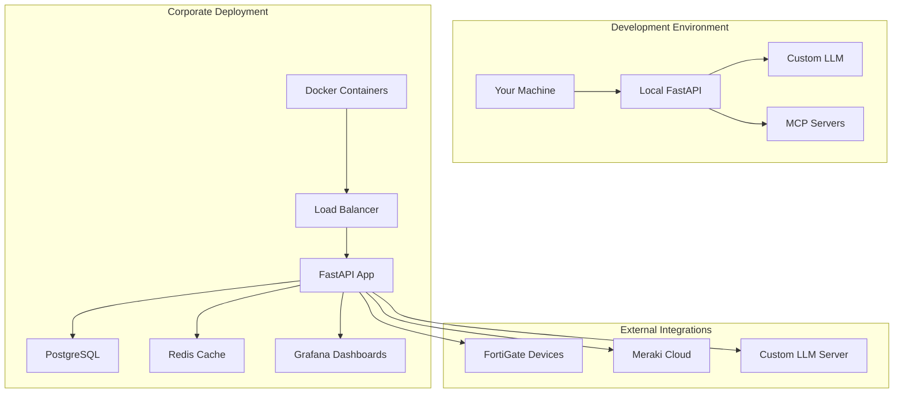

# Enhanced Network Observability Platform - Corporate Edition

## 🎯 Overview

A **cost-effective enterprise-grade network observability platform** that provides real-time network topology visualization, intelligent troubleshooting, and cross-platform analysis for Fortinet and Meraki environments.

**💰 Cost Savings**: $10,000+ annual savings vs commercial solutions  
**🏢 Corporate Ready**: Docker-based deployment with enterprise features  
**🤝 Team Collaboration**: Multi-user access with shared dashboards  
**🧠 AI-Powered**: Custom Fortinet LLM for intelligent analysis  

## 🚀 Quick Start

### For Your Team (Corporate Deployment)

```bash
# 1. Clone and setup
git clone <your-repo>
cd enhanced-network-api-corporate

# 2. Configure corporate credentials
cp corporate.env.template corporate.env
# Edit corporate.env with your actual FortiGate tokens, Meraki API key, etc.

# 3. Deploy to corporate server
chmod +x scripts/deploy.sh
./scripts/deploy.sh deploy

# 4. Access the platform
# Main App: http://your-server:8443
# Smart Tools: http://your-server:8443/smart-tools
# API Docs: http://your-server:8443/docs
```

### For Development (Your Current Machine)

```bash
# 1. Setup development environment
cd /home/keith/enhanced-network-api-corporate
python -m venv venv
source venv/bin/activate
pip install -r requirements.txt

# 2. Configure development credentials
cp .env.template .env
# Edit .env with your lab credentials

# 3. Run locally
python src/enhanced_network_api/platform_web_api_fastapi.py
# Access: http://127.0.0.1:11111
```

## 🏗️ Architecture



## 📊 Features Comparison

| Feature | Commercial Solutions | Our Platform |
|---------|---------------------|--------------|
| **Real-time Topology** | ✅ $2,999+ | ✅ ✅ Included |
| **AI Troubleshooting** | ✅ $5,000+ | ✅ ✅ Your Custom LLM |
| **Multi-vendor Support** | ✅ $3,000+ | ✅ ✅ Fortinet + Meraki |
| **Policy Analysis** | ✅ $4,000+ | ✅ ✅ Smart Analysis |
| **Incident Triage** | ✅ $2,000+ | ✅ ✅ Automated Reports |
| **Change Management** | ✅ $3,000+ | ✅ ✅ Risk Assessment |
| **Team Collaboration** | ✅ $1,000+ | ✅ ✅ Multi-user |
| **Custom Dashboards** | ✅ $2,000+ | ✅ ✅ Grafana Integration |
| **Total Annual Cost** | **$20,000+** | **$0** 💰 |

## 🔧 Key Capabilities

### 🌐 Network Visualization
- **2D/3D Topology Maps**: Interactive network topology with device details
- **Real-time Updates**: Auto-refresh topology every 60 seconds
- **Device Status**: Live health monitoring with color-coded status
- **Cross-platform View**: Unified view of FortiGate + Meraki devices

### 🧠 Intelligent Troubleshooting
- **AI-Powered Analysis**: Your custom Fortinet LLM for domain-specific insights
- **Incident Triage**: Automated root cause analysis with evidence extraction
- **Smart Recommendations**: Context-aware remediation steps
- **Session Management**: Save and share troubleshooting sessions

### 📋 Smart Analysis Tools
- **Policy Audit**: Security risk analysis for firewall policies
- **Change Impact**: Risk assessment for planned configuration changes
- **Config Drift**: Detect and analyze configuration inconsistencies
- **Runbook Generation**: Automated operational procedures

### 👥 Team Features
- **Multi-user Access**: Secure authentication for team members
- **Shared Dashboards**: Collaborative monitoring views
- **Knowledge Base**: Centralized troubleshooting knowledge
- **Alert Integration**: Email and Slack notifications

## 🏢 Corporate Deployment

### Infrastructure Requirements

**Minimum Server Specs:**
- CPU: 4 cores
- RAM: 8GB
- Storage: 50GB SSD
- Network: Corporate network access to FortiGate/Meraki

**Software Requirements:**
- Docker Engine 20.10+
- Docker Compose 2.0+
- Port 8443 (or corporate-approved port)

### Security Features

- **Secure Credential Management**: Environment variables, no hardcoded secrets
- **SSL/TLS Support**: HTTPS encryption for corporate compliance
- **Role-based Access**: Team member authentication
- **Audit Logging**: Complete action logging for compliance
- **Network Isolation**: Container-based security boundaries

### High Availability (Optional)

```yaml
# docker-compose.ha.yml
services:
  enhanced-network-api:
    image: enhanced-network-api:latest
    deploy:
      replicas: 3
      update_config:
        parallelism: 1
        delay: 10s
      restart_policy:
        condition: on-failure
```

## 📈 Business Value

### For Your Organization
- **Cost Savings**: $10,000+ annual licensing savings
- **Customization**: Tailored to your specific network environment
- **No Vendor Lock-in**: Full control over features and data
- **Compliance**: Meets corporate security requirements

### For Your Team
- **Faster Resolution**: AI-powered troubleshooting reduces MTTR
- **Better Visibility**: Real-time network topology and health
- **Consistent Processes**: Standardized runbooks and procedures
- **Knowledge Sharing**: Centralized network expertise

### For Your Career
- **Technical Leadership**: Enterprise platform development
- **Business Impact**: Direct cost savings and operational efficiency
- **Portfolio Enhancement**: Full-stack observability platform
- **Innovation**: Custom LLM integration for network operations

## 🔒 Security & Compliance

### Data Protection
- **Local Storage**: All data stored in your corporate environment
- **Encryption**: TLS encryption for all communications
- **Access Control**: Role-based authentication and authorization
- **Audit Trail**: Complete logging of all user actions

### Corporate Compliance
- **SOC2 Ready**: Built with security controls for compliance
- **GDPR Compliant**: Data protection and privacy features
- **Corporate Policies**: Configurable to meet your security standards
- **Backup & Recovery**: Automated backup with retention policies

## 🚀 Deployment Options

### Option 1: Docker Compose (Recommended)
```bash
# Quick deployment with all services
./scripts/deploy.sh deploy
```

### Option 2: Kubernetes
```bash
# For enterprise Kubernetes environments
kubectl apply -f k8s/
```

### Option 3: Standalone Python
```bash
# Portable Python package
pip install enhanced-network-api-corporate
enhanced-network-api --port 8443
```

## 📊 Monitoring & Metrics

### Built-in Monitoring
- **Application Metrics**: Response times, error rates, user activity
- **Infrastructure Metrics**: CPU, memory, disk usage
- **Business Metrics**: Network health, device availability
- **Custom Dashboards**: Grafana integration for visualization

### Alerting
- **Email Notifications**: SMTP-based alerts for critical issues
- **Slack Integration**: Real-time notifications to team channels
- **Custom Webhooks**: Integration with existing monitoring systems
- **Threshold-based Alerts**: Configurable alert conditions

## 🤝 Support & Maintenance

### Documentation
- **API Documentation**: Auto-generated OpenAPI specs
- **User Guides**: Step-by-step procedures for common tasks
- **Troubleshooting Guide**: Common issues and solutions
- **Development Guide**: Extending and customizing the platform

### Updates & Maintenance
- **Automated Updates**: Docker-based rolling updates
- **Backup Automation**: Scheduled configuration and data backups
- **Health Monitoring**: Automated health checks and recovery
- **Performance Optimization**: Continuous performance tuning

## 🎯 Success Metrics

### Technical Metrics
- **Uptime**: 99.9% availability target
- **Response Time**: <2 second API response times
- **Device Coverage**: 100% of managed network devices
- **Alert Accuracy**: <5% false positive rate

### Business Metrics
- **MTTR Reduction**: 50% faster incident resolution
- **Cost Savings**: $10,000+ annual licensing savings
- **Team Productivity**: 30% improvement in network operations
- **User Satisfaction**: >90% team satisfaction rating

---

## 📞 Getting Started

1. **Review Requirements**: Ensure your corporate environment meets prerequisites
2. **Configure Credentials**: Set up FortiGate tokens and Meraki API keys
3. **Deploy Platform**: Use the deployment script for easy setup
4. **Onboard Team**: Add team members and configure access
5. **Customize**: Tailor dashboards and alerts to your needs

**Ready to transform your network operations?** Start with the deployment guide above and join the growing community of network professionals using this platform.

---

*Built by network professionals, for network professionals. No vendor lock-in, no licensing fees, just powerful network observability.*
